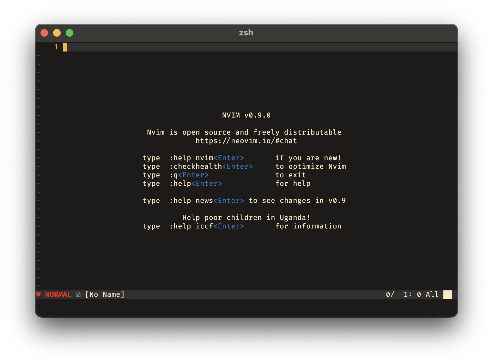
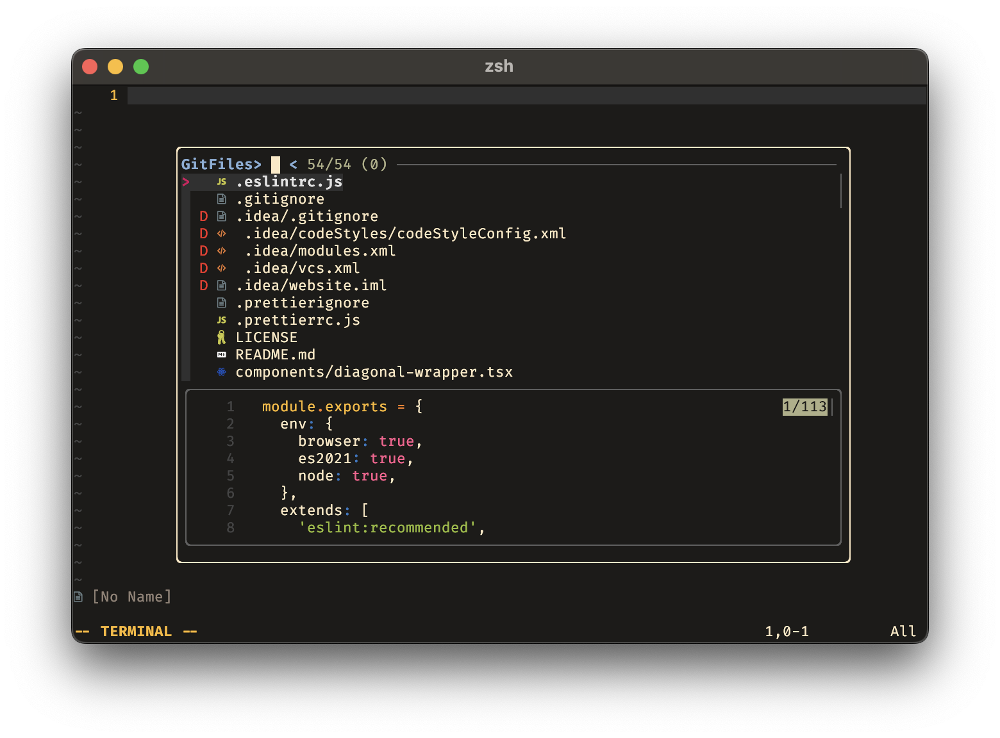
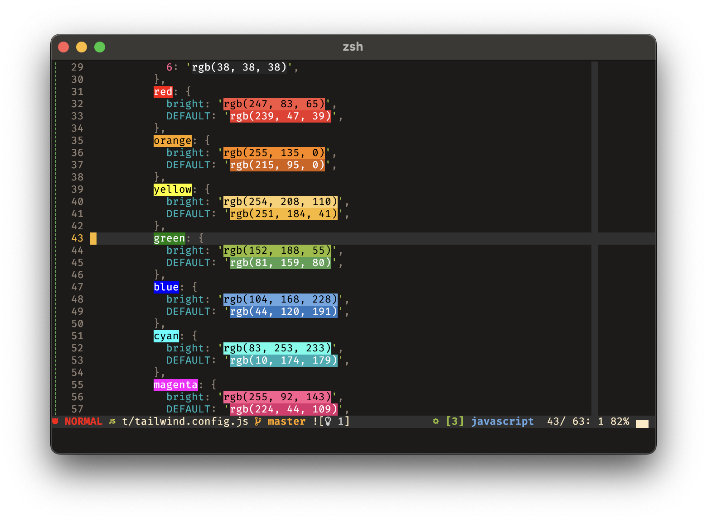
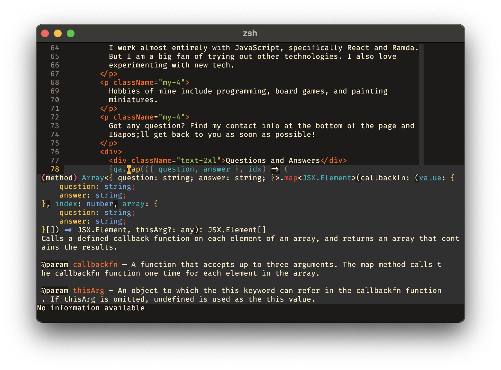

# Neovim Module

Contains my neovim configuration.

# Features

- Useful plugins
  - Most come from the nixpkgs repository.
  - There exists a file of custom plugins which are not in nixpkgs.
- Fully configured LSP
  - Some LSs are installed from nixpkgs. The are installed by Mason.nvim.
- [Srcery](https://srcery.sh) theme.
- Directory browser is `dirvish.vim`. It makes the directories act like a vim
  buffer. No popups or anything
- Searcher is `fzf.lua`. I found telescope to be slow and I lost patience with
  it.
- Statusbar is by `heirline.nvim`. It's a highly configurable plugin and works
  great for me.
- Pretty quick startup time. Currently measured once at ~240ms. That's more
  than fast enough for me. I pretty much start it once per tmux instance and
  leave it open.

# No Nix? No Problem!

You can copy the entire config directory into `~/.config/nvim/` and just use it
as a standard neovim config.

Then call

```lua
require('milogert.main').setup({
  -- This is unused currently.
  nix = false,

  debuggers = {
    elixir_ls = "path/to/elixir_ls",
    vscode_js = {
      adapter = "path/to/vscode_js_debug_adapter",
      debugger = "path/to/vscode_js_debugger",
    },
  },

  -- Not including any of these will just disable that language server.
  ls_cmds = {
    cssls = { "bin/command", ...args },
    elixirls = { "bin/command", ...args },
    eslint = { "bin/command", ...args },
    html = { "bin/command", ...args },
    jsonls = { "bin/command", ...args },
    lua_ls = { "bin/command", ...args },
    nil_ls = { "bin/command", ...args },
    stylua = { "bin/command", ...args },
    tailwindcss = { "bin/command", ...args, },
    terraformls = { "bin/command", ...args },
    texlab = { "bin/command", ...args },
    ts_ls = { "bin/command", ...args, },
  },
})
```

## Caveats

- My plugin manager is Nix, as a result I have no plugin manager installed. You
  will want one.
- You will need to install treesitter parsers by modifying the `treesitter.lua`
  file.

# Screenshots

It's a text editor. Mostly just black-ish screens.

<p float="left">
  
  
</p>

<p float="left">
  
  
</p>

## Plugins

Oh boy. Probably too many.

| Name and Link                 | Feature | How I use it |
| ---                           | ---     | ---          |
| `cmp-buffer`                  | `ui` `completion` | Completion for the current buffer. I use this as a test to see "did it detect what I'm really looking for". |
| `cmp-calc`                    | `ui` `completion` | Does math for you in the completion menu. |
| `cmp-cmdline`                 | `ui` `completion` | Command line completion. |
| `cmp-git`                     | `ui` `completion` | Completion for git branches and tags. |
| `cmp-nvim-lsp`                | `lsp` `ui` `completion` | Completion for LS messages. |
| `cmp-nvim-lua`                | `ui` `completion` | Lua completion. Useful for configuring neovim. |
| `cmp-path`                    | `ui` `completion` | Completion for directories. |
| `cmp_luasnip`                 | `ui` `completion` | Completion for luasnip snippets. |
| `comment-nvim`                | `utils` `ui` | Easily comment lines and blocks. On the chopping block. Nascent impelemntion is included in Neovim. |
| `dressing-nvim`               | `lsp` `ui` | Used for nice rename code actions. |
| `elixir-tools-nvim`           | `language` `tools` | Elixir plugin. |
| `fidget-nvim`                 | `lsp` `ui` | Show LS status when things are doing work. |
| `friendly-snippets`           | `ui` `completion` | Snippets for luasnip. I don't think this is properly configured. |
| `fzf-lsp-nvim`                | `completion` `lsp` `ui` | LS querying in fzf. This is basically a helper plugin that does a bunch of work for me. |
| `fzf-lua`                     | `ui` | Searcher in nvim. |
| `gitsigns-nvim`               | `git` `tools` `ui` | Git signs in gutter. |
| `heirline-nvim`               | `ui` | Status bar plugin. |
| `hydra-nvim`                  | `utils` | Unested. |
| `lspkind-nvim`                | `completion` `lsp` `ui` | Set symbols for LSP in completion menus. |
| `luasnip`                     | `ui` `completion` | Snippets. |
| `mason-lspconfig-nvim`        | `lsp` | Glues mason and lspconfig together. |
| `mason-nvim`                  | `lsp` | Manages LS, DAP servers, linters, and formatters. This is _very_ lightly used, only for things not in nixpkgs. |
| `none-ls-nvim`                | `ui` `completion` `lsp` | LS that add hooks for tools on your machine like Prettier. |
| `nui-nvim`                    | `ui` `utils` | UI library. |
| `nvim-cmp`                    | `ui` `completion` `lsp` | Completion menu plugin. Does loads of work for LSP and a bunch of random plugins (direcotry completion, signature hints, buffer completion, command line, math, etc). |
| `nvim-colorizer-lua`          | `ui` | Shows CSS colors in vim. |
| `nvim-dap`                    | `debugger` | Debugger. Not much chance to use this yet. |
| `nvim-dap-ui`                 | `ui` `debugger` | Debugger support. |
| `nvim-dap-virtual-text`       | `ui` `debugger` | Debugger support. |
| `nvim-lspconfig`              | `lsp` | Configure LSs. |
| `nvim-treesitter-textobjects` | `ui` | Treesitter support. |
| `nvim-treesitter`             | `ui` | Highlight and indentation. |
| `nvim-web-devicons`           | `ui` `lsp` | Support for various plugins. |
| `octo-nvim`                   | `tools` | GitHub plugin. |
| `oil-nvim`                    | `tools` | File browser. Treat folders as buffers. |
| `package-info-nvim`           | `tools` | Upgrade packages in `package.json` files. |
| `persistence-nvim`            | `utils` | Saves session state when exiting neovim. `<leader>sr` to **s**ession **r**estore. |
| `plenary-nvim`                | `utils` | Dependecy of various plugins. |
| `srcery-vim`                  | `ui` | My theme 🤤. |
| `supermaven-nvim`             | `tools` | AI completion. |
| `vim-abolish`                 | `utils` | Remove all instances of words. Untested. |
| `vim-dadbod`                  | `tools` | Database browser. |
| `vim-dadbod-completion`       | `tools` | Database browser completion. |
| `vim-dadbod-ui`               | `tools` `ui` | Dadbod UI. |
| `vim-dispatch`                | `tools` | Run builds in the background. |
| `vim-dispatch-neovim`         | `tools` | Support for neovim. |
| `vim-elixir`                  | `tools` `language` | Elixir plugin. |
| `vim-fugitive`                | `tools` | Git plugin. |
| `vim-repeat`                  | `tools` | Repeat _more_ commands. Often used with `vim-surround`. |
| `vim-startuptime`             | `tools` | Run startup time inside Neovim. |
| `vim-surround`                | `tools` | Manipulate surrounds of all sorts. |
| `vim-tmux-navigator`          | `ui` `tools` `tmux` | Navigate from tmux to nvim and back. Makes using tmux panes and nvim seamless. |
| `vim-unimpaired`              | `utils` | Jump around with pairs of `[` and `]`. |
| `vimux`                       | `ui` `tools` `tmux` | Run commands from vim in a tmux pane and come back. Great for running tests or builds. Used heavily with `vim-arpeggio` to quickly run things with minimal keypresses. |

These plugins are not contained in nixpkgs or are, but not the version I want.

| Name and Link          | Feature | How I use it |
| ---                    | ---     | ---          |
| `fzf-lua-overlay`      | `ui` | Overlay for fzf-lua. This is probably not configured. |
| `git-permalink-nvim`   | `tools` | Copy git permalink of the line or lines to the clipboard. |
| `lua-json5`            | `tools` | JSON5 support for lua. |
| `nvim-dap-vscode-js`   | `tools` | VS Code launch.json support in nvim-dap. |
| `nvim-dev-container`   | `tools` `docker` | Untested. |
| `nvim-nio`             | `tools` | Async IO. |
| `nvim-runscript`       | `utils` | Run scripts in neovim and open the output. |
| `output-panel-nvim`    | `tools` | Output panel for LS logging. |
| `playtime-nvim`        | `utils` | Games. |
| `vim-arpeggio`         | `productivitiy` | Chording in vim. |
| `vim-tada`             | `productivitiy` `ui` | Note taking plugin. Generates one note per directory and configured to keep the notes out of the directory I'm in (they all get placed in `~/todos`). |
